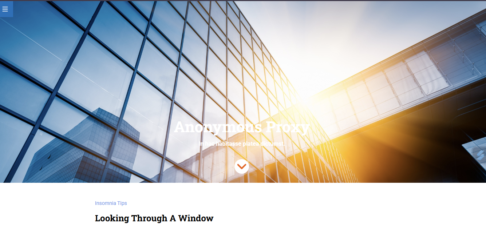

# 🧪 Evaluación Final - Módulo 1 | Promo 53 - Adalab

Este proyecto es el resultado de la evaluación final del Módulo 1 del bootcamp de desarrollo web de Adalab. Consiste en la maquetación de una landing page responsive basada en un diseño proporcionado en Zeplin, utilizando HTML, Sass y buenas prácticas de CSS moderno.

---

## 🚀 Objetivos principales

- Crear una página web a partir de un diseño.
- Usar etiquetas semánticas.
- Utilizar Flexbox, Grid y media queries para lograr un diseño responsive.
- Aplicar Sass con estructuras organizadas (partials, variables, anidación).
- Implementar transiciones y animaciones en elementos clave.

---

## 📸 Vista previa

---

## ⚙️ Cómo instalar y ejecutar el proyecto

Este proyecto utiliza [Vite](https://vitejs.dev/) y el starter kit de Adalab para facilitar el desarrollo.

### 1. Clonar el repositorio

git clone (https://github.com/Roxana-Solano/proyecto-evaluacion-modulo1-landing-responsive.git)
cd nombre-del-repo

### 2. Instalar las dependencias

npm install

### 3. Arrancar el servidor desarrollo

npm run dev

### 4. Crear una versión lista para publicar

npm run build

### 5. Publicar en GitHub page (opcional)

npm run deploy

---

## 🔍 Requisitos:

Tener Node.js instalado.

Tener Git configurado.

Este proyecto se basa en el adalab-web-starter-kit, adaptado para esta evaluación.

---

## 🛠️ Tecnologías utilizadas

- HTML5
- Sass (starter kit de Adalab)
- Flexbox
- CSS Grid
- Media Queries
- Git y GitHub

---

## 🎯 Funcionalidades e interacciones

- Menú hamburguesa fijo y con enlace a Adalab.
- Hero principal con botón que enlaza a la sección "3 Reasons To Purchase".
- Sección con CSS Grid adaptativa en todas las resoluciones.
- Footer con enlaces funcionales y botón con animación que vuelve al inicio.
- Transiciones suaves en los botones con `:hover`.

---

## 📁 Estructura del proyecto

El proyecto sigue la estructura proporcionada por el starter kit de Adalab. Incluye carpetas para:

- `scss/`: archivos Sass organizados en parciales.
- `html/`: estructura HTML semántica.
- `assets/`: imágenes e iconos proporcionados.
- `docs/`: carpeta para la publicación en GitHub Pages.

---

## 🧪 Estado del proyecto

✅ **Finalizado**  
📦 Publicado en GitHub Pages → [Ver demo](https://roxana-solano.github.io/ejercicio-modulo1-roxana/#reason-to-purchase)

---

## 📌 Enlace al diseño original

- [Diseño en Zeplin](https://app.zeplin.io/project/633d72747ae0b42878ea10a2)

---

## 📚 Aprendizajes clave

- Cómo aplicar Flexbox y Grid en distintos contextos.
- Organización y reutilización de código Sass.
- Aplicación de media queries para crear diseños responsive.
- Enlaces internos y externos dentro de una misma página.
- Uso de `transition` y `transform` para interacciones suaves.

---

## 📅 Entrega

**Fecha límite:** Viernes 18 de abril a las 23:59  
**Estado:** Evaluación entregada correctamente y publicada en GitHub Pages

---

## 🙋‍♀️ Autoría

Realizado por **Roxana Solano** como parte del bootcamp de Adalab — Promo 53.

---
